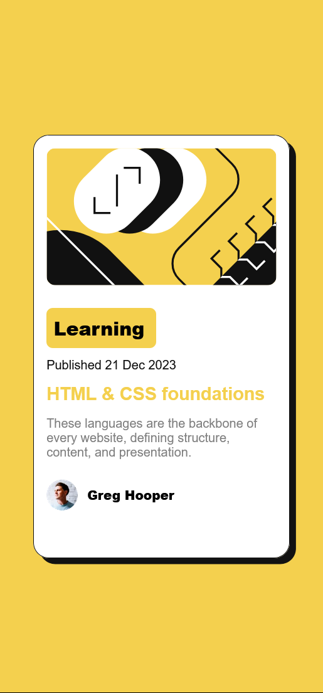
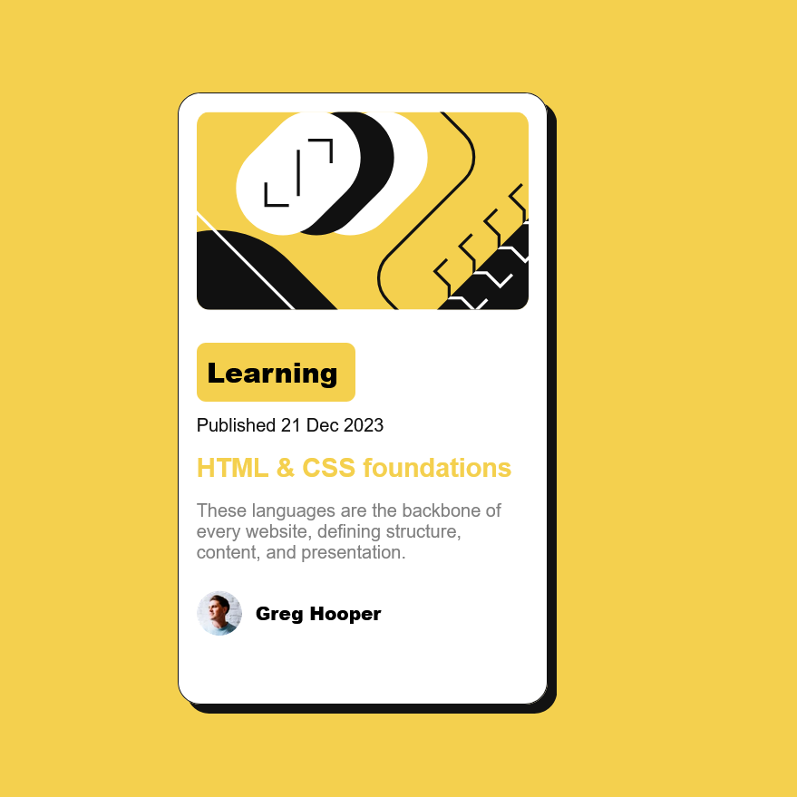

# Frontend Mentor - Blog preview card solution

This is a solution to the [Blog preview card challenge on Frontend Mentor](https://www.frontendmentor.io/challenges/blog-preview-card-ckPaj01IcS). Frontend Mentor challenges help you improve your coding skills by building realistic projects.

## Table of contents

- [Frontend Mentor - Blog preview card solution](#frontend-mentor---blog-preview-card-solution)
  - [Table of contents](#table-of-contents)
  - [Overview](#overview)
    - [The challenge](#the-challenge)
    - [Screenshot](#screenshot)
      - [Phone](#phone)
      - [Desktop](#desktop)
    - [Links](#links)
  - [My process](#my-process)
    - [Built with](#built-with)
    - [What I learned](#what-i-learned)
  - [Author](#author)

## Overview

### The challenge

Users should be able to:

- See hover and focus states for all interactive elements on the page

### Screenshot

#### Phone



#### Desktop



### Links

- Solution URL: [Repository](https://github.com/Valchali/blog-card-preview-main)
- Live Site URL: [Website](https://ekondongayecaba.github.io/blog-card-preview-main)

## My process

### Built with

- Semantic HTML5 markup
- CSS custom properties
- Flexbox
- CSS Grid
- Mobile-first workflow+6

### What I learned

The principal thing that I learned was to use the grid to make the card look better. An extra thing that i learned is how to create variables in CSS.

```css
:root {
  --color-primary: hsl(47, 88%, 63%);
  --color-white: hsl(0, 0%, 100%);
  --color-Grey: hsl(0, 0%, 50%);
  --color-black: hsl(0, 0%, 7%);
  --font-family: "Figtree", sans-serif;
  --font-size: 16px;
  --font-size-title: 23px;
  --box-shadow: 8px 8px 0px var(--color-black);
  --fw-md: 500;
  --fw-lg: 800;
}
```

And another thing that I learned was about shadows, how to mke them.

```css
:root {
  --box-shadow: 8px 8px 0px var(--color-black);
}
```

## Author

- Frontend Mentor - [@EkoNdongAyecaba](https://www.frontendmentor.io/profile/EkoNdongAyecaba)
- Twitter - [@EkoNdongAyecaba](https://twitter.com/Shiitake_EGBM)
